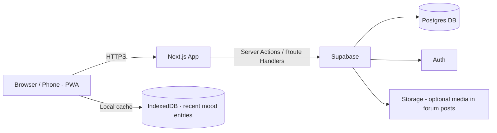
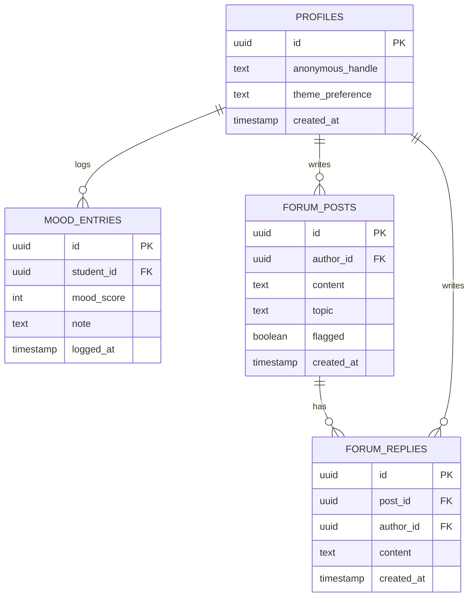

# System Design Document

## 1. Architecture Overview

Mobile-first web app built as a single Next.js application (installable as a PWA for an app-like feel), with Supabase for auth, database, and storage. Mood entries cache locally (IndexedDB/localStorage) so recent history is viewable offline.

## 2. Tech Stack

| Layer | Choice |
|---|---|
| Frontend + API | Next.js (App Router), TypeScript, installable as a PWA |
| Database | Supabase Postgres |
| Auth | Supabase Auth |
| Offline cache | IndexedDB (via a small wrapper, e.g. `idb`) for recent mood entries |
| Styling / UI | Tailwind CSS + shadcn/ui, with a dark mode theme toggle |
| Charts | A lightweight charting library (e.g. Recharts) for mood trend visualization |

*(Flag if you'd rather use a different stack — this is a reasonable default given the mobile-first + offline requirements, not a fixed constraint.)*

## 3. Database Schema (MVP)

Notes:
- `profiles.anonymous_handle` is what's shown on forum posts/replies — never the student's real name or account email
- `forum_posts.flagged` supports a simple manual "report" mechanism (a report sets this true; a staff/admin reviews flagged posts)
- Educational library content and emergency/counselor contact info can be static content (a config file or a `resources` table) rather than dynamic data, since it changes rarely

## 4. Key Workflows

**Mood logging (with offline support)**
1. Student selects a mood and optional note
2. Entry is written to IndexedDB immediately (works offline)
3. When online, entry syncs to `mood_entries` in Supabase
4. Mood history chart reads from Supabase when online, falls back to IndexedDB cache when offline

**Anonymous forum posting**
1. Student writes a post
2. Server Action inserts into `forum_posts`, tagging `author_id` from the session but displaying only `anonymous_handle` on the frontend
3. Other students can reply; replies follow the same anonymity rule

**Emergency support access**
1. A persistent "Get Help Now" element (e.g. in nav bar) is always visible
2. Tapping it shows a static page/modal with hotline numbers/links — no login or API call required, so it works even with poor connectivity

## 5. Deployment

- Repo on GitHub, connected for auto-deploy (Vercel or similar) on push to `main`
- Preview deployments per pull request for team review
- Supabase project shared via environment variables (never committed)

## 6. Out of Scope for MVP

- In-app real-time counselor booking with live availability
- Automated content moderation (AI-based flagging)
- Push notifications
- Personalized resource recommendations based on mood data

These map to the "Stretch" list in `SRS.md`.